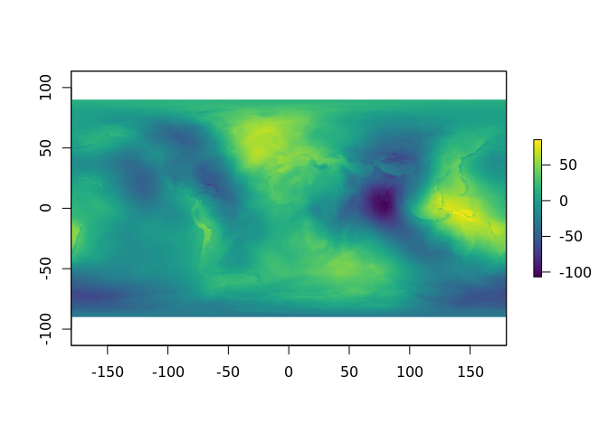
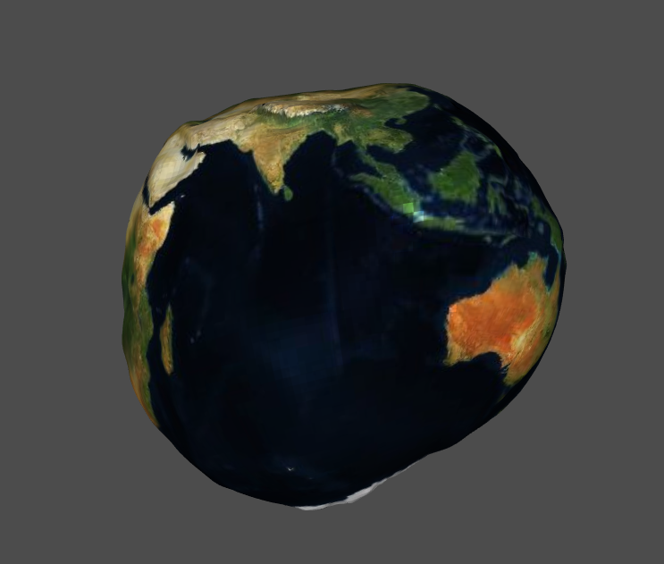

<!-- README.md is generated from README.Rmd. Please edit that file -->
potato
======

The goal of potato is to provide easy access to a geoid model in R.

Example
-------

This is a basic example which shows you how to load and plot the
*potato*.

``` r
library(potato)
library(raster)
#> Loading required package: sp
library(reproj)
library(rgl)
#> Warning in rgl.init(initValue, onlyNULL): RGL: unable to open X11 display
#> Warning: 'rgl_init' failed, running with rgl.useNULL = TRUE


plot(potato_raster, col = viridis::viridis(64))
```



``` r

#remotes::install_github(c("hypertidy/ceramic", "hypertidy/quadmesh"))
im <- ceramic::cc_location(cbind(0, 0), buffer = 6378137 * pi)
potato <- quadmesh::quadmesh(aggregate(potato_raster, fact = 6), texture = im)
#> writing texture image to /mnt/tmp/Rtmpa1veQj/file1f362de8d0d.png
## we can exaggerate the relief, or just reduce the radius
potato <- reproj::reproj(potato, target = "+proj=geocent +a=637")

rgl::rgl.clear()
rgl::shade3d(potato, col = "white")
rgl::aspect3d(1, 1, 1)
rgl::rglwidget()
```



